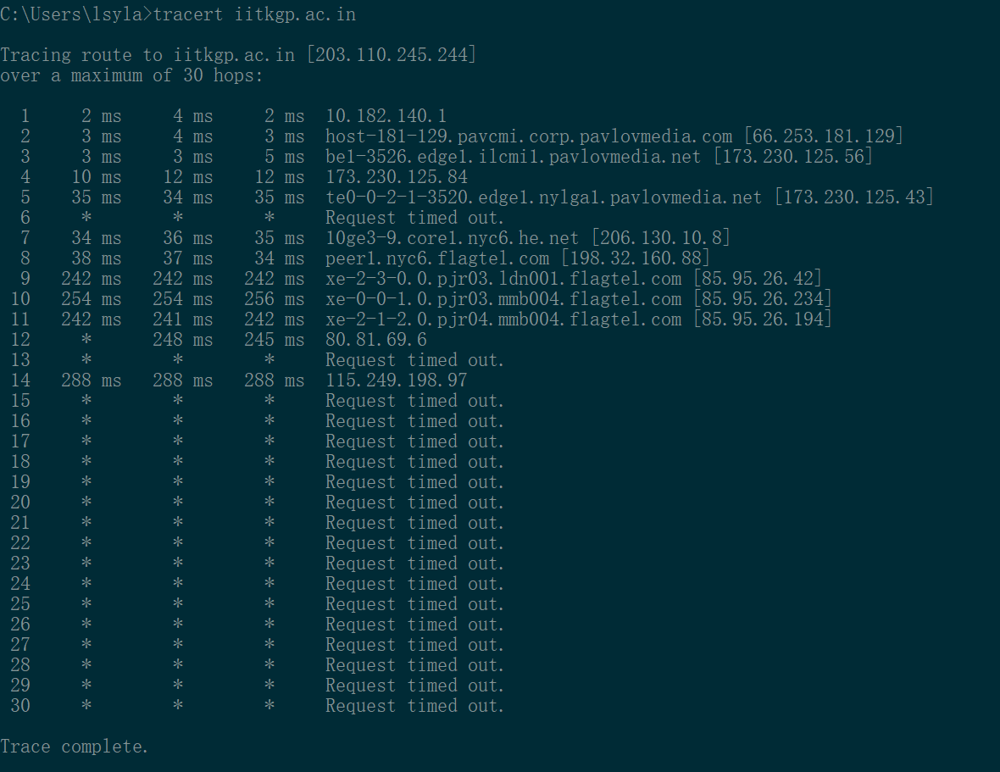
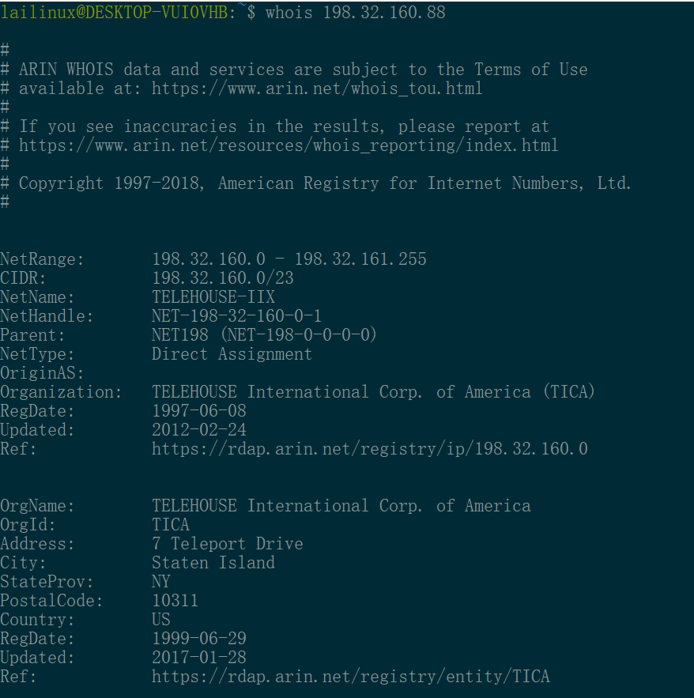
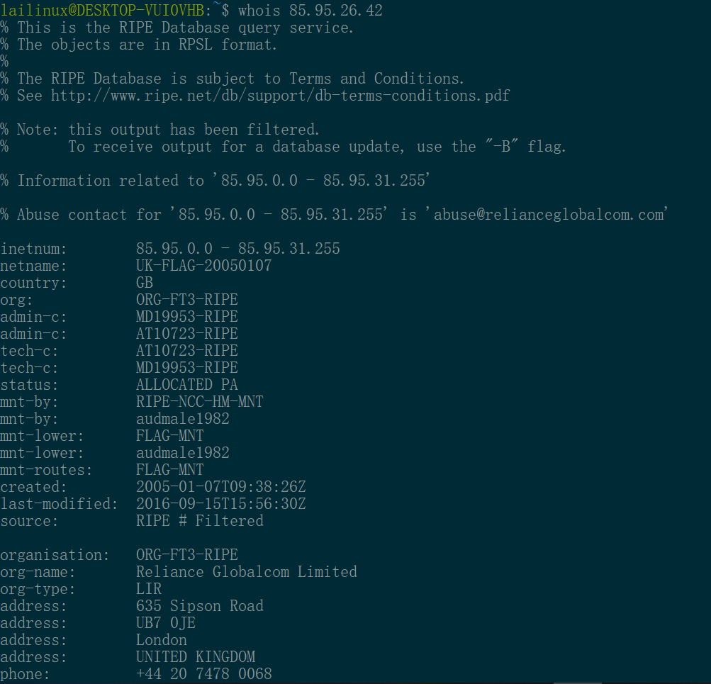

# ECE 438 HW1: Basics and Application Layer

### 1) Assorted question:

a) False. Data rate can be related with bandwidth but is not a function of the center frequency.

b) True. FDM is a way that users share frequency while have access to connection all the time, but TDM require users to share time. 

c) False. Don't know the packet length, so don't know the transmit time.

d) False. When La/R is less than 1, the delay could be small but does not know whether need to wait in a queue. 

e) True.  Since there is 47.6% that there are more than 125 people online at the same, which indicates the bandwidth is larger than 125 Mbps.
$$
P=1-\sum_{n=0}^{n}(^{500}_0)*0.25^n*0.75^{500-n}=0.476
$$

### 2) Bandwidth, data rate and SNR:

a) 
$$
Q = \frac{P}{R^2}=\frac{10}{5^2}=0.4
$$

$$
N = 0.01
$$

$$
SNR=\frac{signal}{noise}=\frac{0.4}{0.01}=40
$$

$$
C = B *log(1+SNR)=20*log(1+40)=20log(41)=32.26Mbps
$$

b) 
$$
B*log(1+SNR) = B*log(1+\frac{Q}{N})=B*log(1+\frac{P}{\overline{R}^2*N})= 2*C
$$

$$ { }
log(1+\frac{P}{\overline{R}^2*N})= 2*\frac{C}{B}
$$

$$
\overline{R}=0.77
$$

c) 
$$
\overline{B} = 2*B = 2*20 =40
$$

### 3) Web Caching:

a) Web caching can reduce traffic on an transition's access link to effectively deliver contents.

b) Though UIUC and Parkland college do not share web caches, if they share some routers more connections, UIUC's excellent web-caching performance can reduce traffic on link. Thus, Parkland college can deliver contents more effective. 

### 4) Packet Tracing:

a)  Each hop is represented by a different line. 

- column 1: index(number): the number of the hop

- column 2 - 4: Time. Traceroute will actually send three packets of data, and measure the time taken for each.
- column 5: Name of the hop.
- column 6: IP address of the hop.

b) Use 'whois [ip]' command to track which locations are the packet flowing through.

c) Since there is a huge gap before going across the Atlantic Ocean.  And I double check the two ip address's location to make sure that 198.32.160.88 is the latest ip before leave US. 
$$
\overline{time} = (38 + 37 +34) / 3 = 36.3ms
$$

d) * means request time is out.  Traceroute rely on ICMP packets being sent to the originator.  * means the router at that hop doesn't respond to the type of packet.

e) The general trend is that larger hop will have larger time, which is caused by the way traceroute work. First of all, every IP packet can specify how many hops it can go through before it is no longer forwarded on. When I was running this command, the default hop number is 30. Packets will be sent recursively, once it arrive each hop, it will send back response to let the original sender who the information of the current hop. And then the sender will send packets again to the further hop. Therefore, the time will be longer when the number of hop increase.

f) Reverse DNS means using IP address to find out its domain name, the reverse way to DNS.