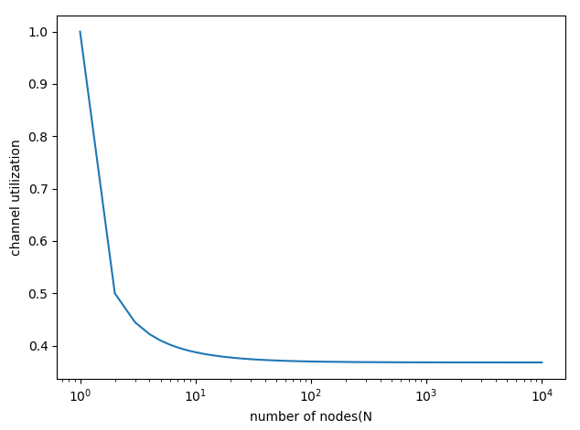
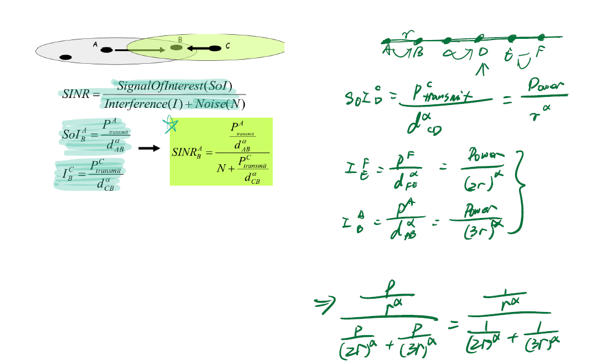
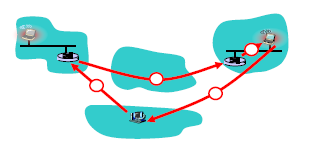

# ECE 438 HW3: Network and Link Layer

## Network Layer

### 1 

a) False. A router don't propagates distance vector updates whenever the cost changes, it updates periodically according to neighbors' advertisement.

b) True. Dijkstra's algorithm works when some link costs are zero.

c) True. If the least cost path between B and N is not [B, C, M, N]

d) False. Hubs can't filter the packet and don't separate packet collision domains.

e) True.  Since IP address in subnet unique map ports of NAT ip address. Thus, N is bounded of ports supported by the network.


### 2

a)  There can be error during the transmission between network layers which needed parity check for error check.

b) A switch can be directly used without config.

c) Multiple IP address can easily share inference and it's a easy policy for ip matching when ip address with different length prefix need to be matched.

d) Fabric transmits slower than input ports combined and queueing happened. 

e) Distance will changes and updated periodically in response to neighbor's advertisement or other information.


### 3

a) 

- Because Bob's ip address is a private address. Thus, Alice can't send to Bob.
- Bob can sent a tcp socket to Alice. Then, Alice can send package to Bob through this socket.

b) 

 -  eBGP
 -  iBGP
 -  eBGP
 -  iBGP
 -  RIP

c) 

- I1. Since I1 has the smaller hop than I2.
- I2. Since I2 through A2 and A4 has the smaller hop.
- I1. This through I1, the package will go through less AS than through I2.


## Link Layer

### 4

a) True. The collision probability will increase and reduce the channel utilization.

b) False. For wireless, signal power will decrease due to location.

c) False. Though RTS/CTS can solve some hidden terminal problem, it's still possible to cause hidden terminal problem, since propagation delay means two nodes may not hear each other's transmission.

d) False. Two codes are not orthogonal. Thus, they are not valid CDMA codes.

e) True. Two codes are orthogonal. Thus, they are valid CDMA codes.


### 5 Randomized Backoff

a) The minimum value of the time-slot depends on size of packet.

b) If the time-slot is less than minimum value, than when sending packet, there will always be collision due to the previous packet in queue is still sending. 


### 6 Channel Utilization

Utilization = N * P * [(1-P)^(N-1)]

When p* = 1/N, it will get the maximum channel utilization.

```python
import matplotlib.pyplot as plt

if __name__ == "__main__":
    x = []
    y = []
    for N in range(1, 10000):
        x.append(N)
        temp = pow(1-float(1.0/N), N-1)
        y.append(temp)
    plt.figure()
    plt.xlabel('number of nodes(N)')
    plt.ylabel('channel utilization')
    plt.semilogx(x, y)
    plt.show()
```




### 7 Wireless SNR




### 8 Mobile Networks

a) Triangle Routing Problem: when Bob want to call Alice's mobile. First find Alice permanent address, then check Alice's current location's host. Then use indirect/direct routing to call Alice.



b)

- indirect routing: communication from correspondent to mobile goes through home agent, then forwarded to remote. If host and mobile is close while host and home agent is far, indirect routing is expensive. In other words, inefficient when correspondent, mobile are in same network.
- direct routing：correspondent gets foreign address of mobile, sends directly to mobile. When mobile moves, then need to find out latest address again and package may lost during transmission. 


